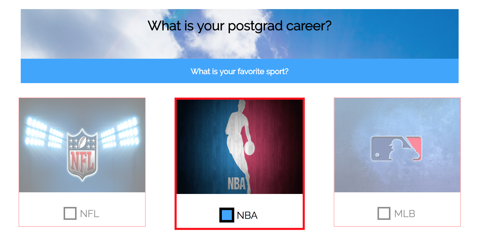

Anish Chadalavada  
Computer Science 52  
Lab Assignment 2  

I really enjoyed this assignment overall, and I think it came out pretty well. I was motivated to make as good as I could stylistically, and incorporated some new features to do so. My quiz is 7 questions, with each of the questions containing 6 answers.  

I used a video from the Hooli website (from the TV show Silicon Valley) as my header image, and I thought this looked very cool! Credit to the designers of that site for that feature.    

One of the things I struggled with was designing a JavaScript function to mute the unselected radio buttons once one was selected, while also allowing for answer changes and updates. However, after research about HTMLInput Objects and how to access them, I was able to access and change the style of parent elements for radio buttons based on whether they were selected or not (using the .checked boolean attribute). This was probably the most difficult part of the lab, but quite rewarding when I finally got it working.

This is an example of when a button is selected

Please see site itself for all the features!

Citations, general (contained inline for specifics)

http://stackoverflow.com/questions/11722400/programmatically-change-the-src-of-an-img-tag  
https://www.w3schools.com/jquery/misc_toarray.asp  
https://www.w3schools.com/jsref/jsref_tostring_array.asp    
http://stackoverflow.com/questions/9618504/get-radio-button-value-with-javascript  
https://www.w3schools.com/js/js_loop_for.asp  
https://www.w3schools.com/jsref/jsref_parseint.asp  
https://www.w3schools.com/js/js_array_methods.asp  
http://stackoverflow.com/questions/7647095/getting-html-elements-by-their-attribute-names  
 https://www.w3schools.com/jsref/prop_node_parentelement.asp   
https://www.w3schools.com/jsref/dom_obj_radio.asp   
http://www.hooli.xyz/  
http://stackoverflow.com/questions/16615222/how-to-overlay-embed-bootstrap-button-on-image  
http://stackoverflow.com/questions/2491068/does-height-and-width-not-apply-to-span  
https://www.sitepoint.com/replacing-radio-buttons-without-replacing-radio-buttons/  
https://www.w3schools.com/css/css3_buttons.asp  
https://www.w3schools.com/howto/howto_css_modals.asp   
https://css-tricks.com/snippets/css/a-guide-to-flexbox/
